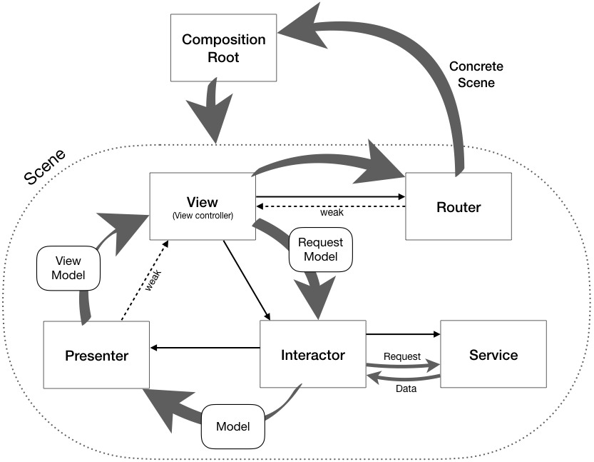

## LastFM Browser Demo

- The app retrieves the list of top artists from LastFM. 
- Selecting an artist displays the list of similar artists.

To run the app you will need to provide a LastFM API key in Settings -> LastFM. Naturally, API key is not required to run unit tests as they rely on mocks.

### Architecture

The project demonstrates a version of VIP/Clean Architecture approach to the app architecture design. Unlike variations of MVC/MVVM this covers the entire architecture of the app, not just the interactions with UI layer. Another notable difference is a much clearer separation between roles of a *layer* (module) and a *model* wherein *models* are passed across *layers'* boundaries. The design ensures decoupling, testability, extendability, all those good things. Abstraction is the corner stone of the design as no modules reference each other as concrete types even within a single scene/screen.

Here is how it works.

- AppScene protocol is the **composition root** responsible for instantiation and wiring of all the modules in the scene including injection of a service dependency.
- View Controller represents the **View** layer. It holds strong references to **Interactor** and **Router** 
    - View Controller asks **Interactor** to perform a task within the scene, optionally passing a **Request Model**. 
    - View Controller asks **Router** to navigate to another scene. 
- **Interactor** holds strong references to **Service** and **Presenter**. 
    - **Interactor** interprets a request and sends it to the **Service**.
    - After getting back data from the **Service**, **Interactor** passes **Model** to **Presenter**.
- **Presenter** only holds a weak reference to the **View**. It translates the **Model** to **View Model** and passes it onto the **View**.
- **Router** knows the concrete type the next scene will be built off, but relies on abstraction to delegate creation of the new scene to the **composition root**. **Router** only holds a weak reference to the **View** to trigger UIKit navigation events. 

